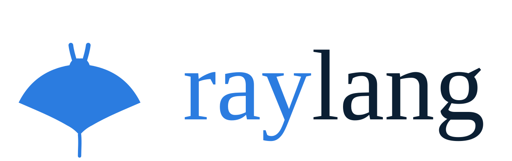
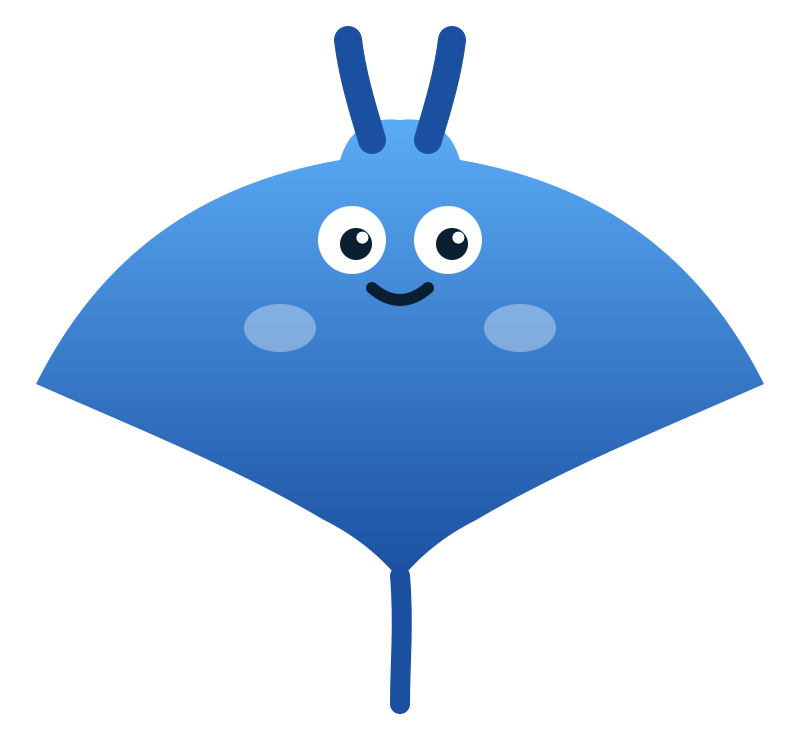

<div align="center">

<picture>
  <source media="(prefers-color-scheme: dark)" srcset="assets/raylang-lockup-horizontal-dark.svg">
  
</picture>

**Un lenguaje de programación estáticamente tipado, orientado a expresiones y auto-alojado — escrito en Rust, con casi cero dependencias.**

[](https://github.com/roberto-ayala/raylang/actions/workflows/ci.yml)
[](#licencia)
[](CHANGELOG.md)

[Instalación](#instalación) · [Un vistazo](#un-vistazo-al-lenguaje) · [Playground](#playground-web) · [Documentación](#documentación) · [Lo notable](#lo-notable)

</div>

---

**raylang** es un proyecto de aprendizaje llevado hasta sus últimas consecuencias: construir un lenguaje de
programación de principio a fin, tocando **todas** las fases y problemáticas. El resultado es un lenguaje real
—con genéricos, traits, pattern matching, concurrencia multicore por actores y un ecosistema de herramientas—
que además se **compila a sí mismo** (self-hosting) y corre **en el navegador** vía WebAssembly.

El anfitrión es **Rust** (una VM de bytecode con GC como motor de producto; un intérprete tree-walking como
oráculo de validación). La invariante de diseño es **casi cero dependencias de Cargo**: la única excepción
consciente es TLS/criptografía (`rustls`/`ring`).

```rust
enum Arbol { Hoja, Nodo(Arbol, int, Arbol) }

fn suma(a: Arbol) -> int {
    match (a) {
        Arbol.Hoja => 0,
        Arbol.Nodo(izq, v, der) => suma(izq) + v + suma(der),
    }
}

fn main() -> int {
    let t = Arbol.Nodo(Arbol.Nodo(Arbol.Hoja, 1, Arbol.Hoja), 2, Arbol.Nodo(Arbol.Hoja, 3, Arbol.Hoja));
    print("suma del árbol: ${t.suma()}");    // UFCS + interpolación  → 6

    let s = [1, 2, 3, 4, 5]
        .iter()
        .map(fn(x: int) -> int { x * x })
        .sum();                              // iteradores perezosos + closure  → 55
    print("suma de cuadrados: ${s}");
    0
}
```

## Por qué mirarlo

- **Norte de diseño sin `null`.** Los errores son valores: `Option<T>`/`Result<T,E>` + el operador `?`.
- **Orientado a expresiones.** `if`, bloques y `match` producen valor; retorno implícito.
- **Sistema de tipos rico.** Genéricos con inferencia, **traits** (despacho estático, *bounds*, impls
  genéricos, métodos por defecto, `dyn A + B`), tipos suma y **pattern matching** exhaustivo (con guardas,
  `if let`, patrones anidados).
- **Ergonomía moderna.** UFCS (`x.f()`), pipelines (`x |> f()`), closures, e iteradores perezosos
  (`map`/`filter`/`take`/`zip`/`fold`/`collect`/…).
- **Concurrencia de verdad.** Modelo de **actores con aislamiento de heap** + canales tipados, sobre un
  scheduler **M:N multicore** con *data-race freedom* por construcción.
- **Auto-alojado.** El lexer, parser, checker, intérprete y VM de raylang están escritos **en raylang**.
- **Corre en el navegador.** La VM compilada a WebAssembly, sin `wasm-bindgen`.

## Instalación

### `curl | sh` (macOS / Linux)

```sh
curl -sSfL https://raw.githubusercontent.com/roberto-ayala/raylang/main/install.sh | sh
```

Instala los binarios `ray` (y su alias `raylang`) en `~/.local/bin`. En **Windows**, descarga el `.zip` de
la [última release](https://github.com/roberto-ayala/raylang/releases).

### Desde el código

```sh
git clone https://github.com/roberto-ayala/raylang
cd raylang
cargo build --release          # target/release/ray
```

> Rust se instala vía [rustup](https://rustup.rs/). Casi cero dependencias: solo `rustls`/`ring` (TLS/cripto).

## Uso

```sh
ray new hola           # crea un proyecto (ray.toml + src/main.ray)
cd hola
ray run                # ejecuta src/main.ray en la VM
ray build              # chequea y compila sin ejecutar
ray test               # corre las funciones @test
ray fmt src/main.ray   # formatea
ray doc src/main.ray   # genera documentación desde /// 
ray repl               # REPL interactivo
ray lsp                # servidor LSP (diagnósticos, hover, definición, refs, rename, completado, formateo, símbolos…)
```

El código de salida de `ray run` es el `int` que devuelve `main` (0 si es `unit`). Para embeber raylang
confinado: `ray run --fuel N` (límite de instrucciones) y `--heap N` (tope de objetos). Concurrencia
reproducible: `--deterministic`.

## Un vistazo al lenguaje

**Traits + genéricos:**

```rust
trait Mostrable { fn mostrar(self) -> string; }

struct Punto { x: int, y: int }
impl Mostrable for Punto {
    fn mostrar(self) -> string { "(${self.x}, ${self.y})" }   // interpolación de strings
}

fn imprime<T: Mostrable>(v: T) { print(v.mostrar()); }
```

**Errores como valores + `?`:**

```rust
fn dividir(a: int, b: int) -> Result<int, string> {
    if (b == 0) { Result.Err("división por cero") } else { Result.Ok(a / b) }
}

fn calc() -> Result<int, string> {
    let x = dividir(10, 2)?;   // desempaqueta o retorna el Err
    Result.Ok(x + 1)
}
```

**Concurrencia (actores + canales):**

```rust
fn main() -> int {
    let ch: Channel<int> = channel();
    spawn(fn() { var i = 0; while (i < 5) { send(ch, i * i); i = i + 1; } close(ch); });
    var total = 0;
    var seguir = true;
    while (seguir) {
        match (recv(ch)) {
            Option.Some(v) => { total = total + v; },
            Option.None => { seguir = false; },
        }
    }
    print("total: ${total}");   // 0+1+4+9+16 = 30
    0
}
```

Hay **156 ejemplos** en [`examples/`](examples/): desde `fib`/`fizzbuzz` hasta trait objects, structured
concurrency, un servidor web, WebSockets, y el propio compilador auto-alojado en [`selfhost/`](selfhost/).

## Playground web

raylang corre en el navegador (la VM compilada a `wasm32`, **cero `wasm-bindgen`**):

```sh
./playground/build.sh
cd playground && python3 -m http.server 8000   # → http://localhost:8000
```

Cubre el lenguaje núcleo (todo el lenguaje + prelude + stdlib pura). Ver [`playground/`](playground/).

## Lo notable

- **Self-hosting + meta-circularidad.** raylang lexea/parsea/chequea/ejecuta raylang, con el toolchain de
  Rust como oráculo. El compilador auto-alojado se ejecuta a sí mismo sobre el intérprete y la VM
  auto-alojados.
- **Multicore por actores.** Heap por fibra + transferencia de propiedad en `send` → *data-race freedom*
  sin *ownership* en el tipo. Scheduler M:N con speedup real medido; `--deterministic` para tests.
- **Dos motores que coinciden.** Un oráculo VM↔intérprete blinda cada cambio de runtime.
- **Casi cero dependencias.** Todo (JSON, TOML, HTTP/2, HPACK, LSP, `dlopen`, `kqueue`/`epoll`, SHA en el
  gestor de paquetes…) está escrito a mano; la única excepción es TLS/`ring`.
- **Robusto ante entrada arbitraria.** Compilador sin pánicos + **fuzzing continuo** del front-end.

## Documentación

| Documento | Qué es |
|-----------|--------|
| [`MANUAL.md`](MANUAL.md) | La **guía práctica**: cómo usar el lenguaje, idiomas, y mejores prácticas. |
| [`REFERENCIA.md`](REFERENCIA.md) | El **catálogo exhaustivo**: palabras clave, operadores, builtins, prelude, `std/` y CLI, con firmas. |
| [`PUBLICAR.md`](PUBLICAR.md) | La guía del **publicador**: empaquetar, versionar y publicar en el registro. |
| [`SPEC.md`](SPEC.md) | La **especificación normativa** del lenguaje (gramática + semántica). |
| [`book/`](book/) | El **libro** (mdBook): cómo se **construyó** el lenguaje, fase a fase. |
| [`DESIGN.md`](DESIGN.md) | La **crónica de diseño**: cada decisión y su porqué. |
| [`IDEAS.md`](IDEAS.md) | Backlog de features y su clasificación de impacto. |
| [`SECURITY.md`](SECURITY.md) | Política de seguridad y modelo de amenazas. |
| [`RELEASE-1.0.md`](RELEASE-1.0.md) | Checklist del estado hacia la 1.0. |

Editores: extensión de [VSCode](editors/vscode/) (con cliente LSP), paquete de [Sublime Text](editors/sublime/),
y config para Neovim/Helix (usan `ray lsp` directo).

## Estado

**raylang 1.0.0.** Motor de producto = la VM; el intérprete es el oráculo de desarrollo. La suite tiene
**442 tests unitarios** + **72 archivos de tests de integración** (incluido un fuzzer del front-end y los
oráculos VM↔intérprete). Ver [`CHANGELOG.md`](CHANGELOG.md).

Es un **proyecto de aprendizaje**: real y cuidado, pero no pensado para producción crítica.

## Contribuir

Cada fase del proyecto es un commit con sus tests (Conventional Commits en español). El código y la
documentación están en español. Antes de tocar comportamiento, lee los documentos-contrato (`SPEC.md`,
`DESIGN.md`). Para reportar una vulnerabilidad, ver [`SECURITY.md`](SECURITY.md).

## Licencia

Doble licencia, a tu elección:

- **MIT** ([`LICENSE-MIT`](LICENSE-MIT))
- **Apache-2.0** ([`LICENSE-APACHE`](LICENSE-APACHE))

`SPDX-License-Identifier: MIT OR Apache-2.0`

---

<div align="center">

<br>
<sub>La identidad de marca (logo, variaciones, colores) vive en <a href="assets/"><code>assets/</code></a> · <a href="assets/branding/raylang-brand.pdf">libro de marca</a>.</sub>
</div>
