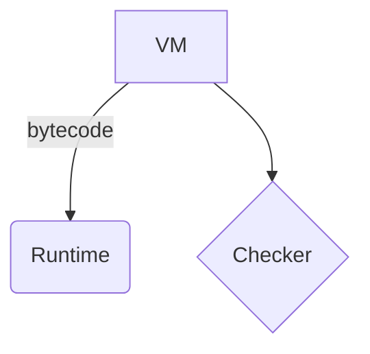

# Título *con énfasis*

Un párrafo con **negrita**, _cursiva_, `código`, un [enlace](https://example.com/a?b=1&c=2) y
una segunda línea del mismo párrafo.

## Lista

- uno
- dos con **negrita**
  - anidado A
  - anidado B
- tres

1. primero
2. segundo

> Una cita con *énfasis*.
> Segunda línea.

```rust
fn main() { println!("hola <mundo>"); }
```

---

Escapes: \*no-énfasis\* y \`no-código\`. HTML crudo: <script>alert(1)</script>.

Peligro: [xss](javascript:alert(1)) e imagen .

## Tabla

| Milestone | Estado | Tests |
|:----------|:------:|------:|
| M108      | *ok*   | 5     |
| M111 con \| pipe | **ok** | 12 |

## Diagrama



## Detalles CommonMark

Prosa con snake_case_name y __init__ en negrita.

2. empieza en dos
3. sigue
